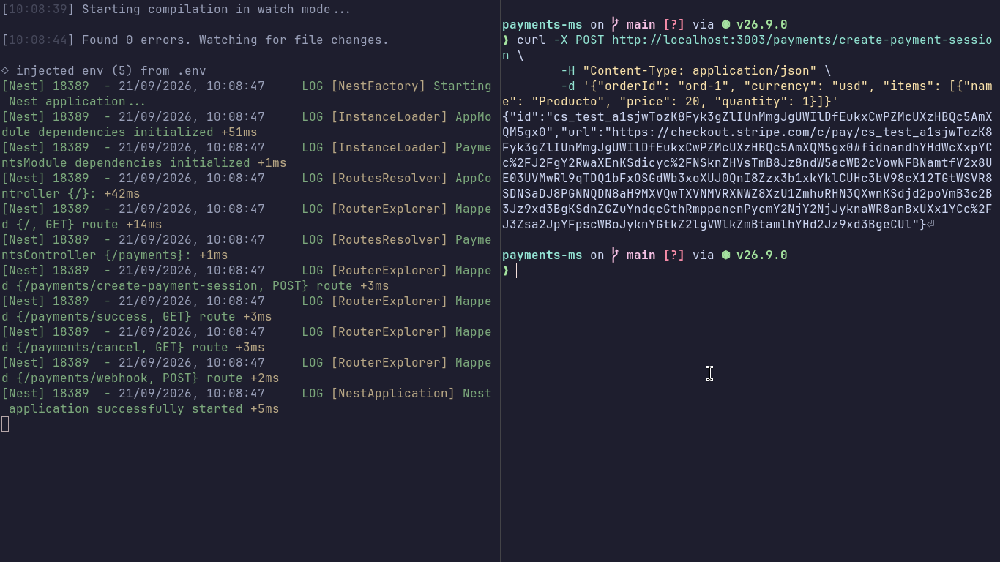
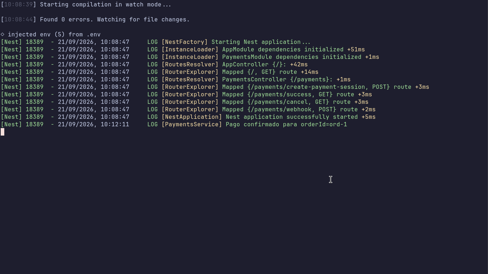

# Payments MS

Microservicio en NestJS que gestiona pagos con Stripe: crea sesiones de pago (Checkout Sessions) y confirma, mediante un webhook, cuando el cobro se concreta.

## Instalación

1. Instalar las dependencias: npm install
2. Copiar el archivo de variables de entorno: cp .env.template .env
3. Completar STRIPE_SECRET en el .env con la clave de test de Stripe (en el campo sk_test_...).
4. Levantar el servidor: npm run start:dev

## Rutas

| Método | Ruta | Qué hace |
|---|---|---|
| POST | /payments/create-payment-session | Crea la sesión de pago en Stripe y devuelve `id` y `url` |
| GET | /payments/success | Responde `{"ok": true, ...}` |
| GET | /payments/cancel | Responde `{"ok": false, ...}` |
| POST | /payments/webhook | Verifica la firma y, si el evento es `charge.succeeded`, registra el `orderId` |

## Evidencia de funcionamiento

### Entrega 1. Creación de la sesión de pago

### Entrega 2. Confirmación de pago del webhook
